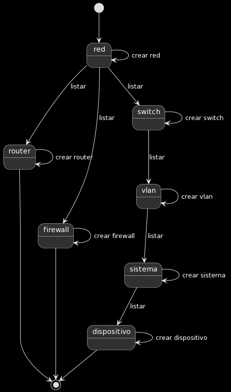
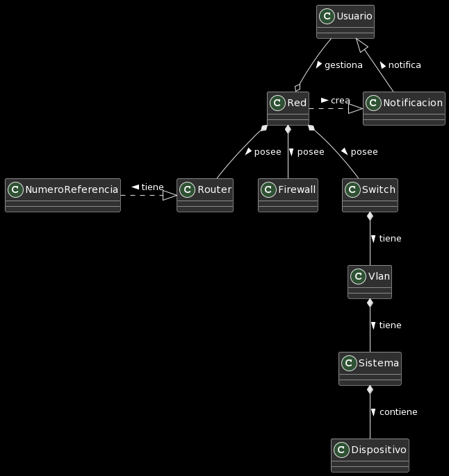

# proyect_IdSw / Diagramas By: Rene

|Diagrama de Clases|
|:-:|
||
|[Código plantuml del diagrama](docs/diagramaClases.plantuml)|
|Diagrama de Estados|
||
|[Código plantuml del diagrama](docs/diagramaEstados.plantuml)|
|Diagrama de Objetos|
||
|[Código plantuml del diagrama](docs/diagramaObjetos.plantuml)|
|Modelo de Dominio|
||
|[Código plantuml del diagrama](docs/modeloDominio.plantuml)|
